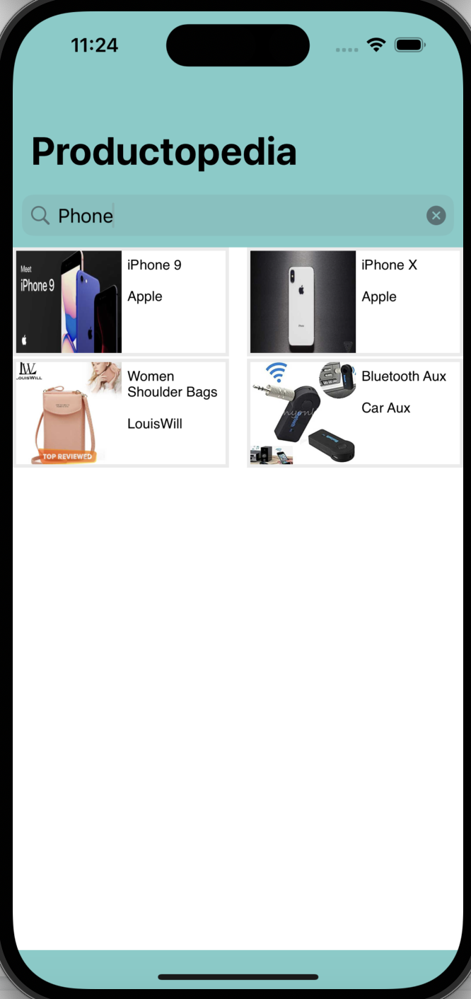

# Productopedia

## Overview

Productopedia is an IOS application created using Swift and UIKit which utilizes an API to search for products using a keyword and then tapping a product to see more details regarding that product. The app is seperated into two screens: the Search Screen and the Product Screen. The first phase of development was acclimating to Xcode and UIKit which I had not previously had experience with before this project. Once I felt comfortable enough with those tools, I began planning out my application using excalidraw and the requirements set by Realtor.com. The final step was planning my project's architecture and implementing my plan. 

## Table of Contents

  - [Architecture](#architecture)
  - [Features](#features)
  - [Author](#author)

## Architecture

### MVC Description

The MVC design pattern was used for this project. MVC stands for Model-View-Controller and is one of the more common IOS design patterns. It seperates the application into three components: Model, View, and Controller. The Model is for housing the important data-related logic that the project requires to function and will be requested by the Controller for that data. The Controller is the interconnection between the Model and the View. It processes all the business logic and user requests in order to manipulate data using the Model and interact with the View to display the correct output. The View houses all the UI logic for the application and generates the user interface for the user.

### Productopedia Architecture Design

For Productopedia, I decided on the MVC model as opposed to other design patterns due to the simplicity of the application and the ability to be able to work on different components at any time. My folders are setup to seperate the Models, Controllers, and Views. 

#### Models

Within the Models folder there is the API Handler, Product, and Response files. The API Handler is a class that can be reused throughout the application to retrieve data from the API, it is used in the search bar component to retrieve the API data when a user searches. The Product file houses the Product struct which is used to define the data required for a product. It is used throughout the application to assist in displaying the products from the search as well as displaying an individual product's details. The final model is the Response file which houses the Response struct. This is used to assist in gathering the data from the API request by imitating the API response thereby the response can be converted to an array of Products so that the products can be accessed correctly by the controllers. 

#### Controllers

Within the Controllers folder, ignoring the AppDelegate and SceneDelegate, there is the SearchScreen and the ProductScreen. The SearchScreen is the first screen you see when loading the application and is a UIViewController. It handles the setup for the view of products displayed, the search bar and an error label. It also handles all the logic for what happens when a user searches or when a user taps on a product. The Product screen is another UIViewController that is displayed when a user taps on a product on the Search Screen. It displays a carousel of the product's images at the top half of the screen and displays the details of the product in a text view on the bottom of the screen. 

#### Views

The Views folder houses the CarouselCell and ProductCollectionViewCell. The CarouselCell houses an image view so that the carousel will display the images of the desired product. It is controlled by the ProductScreen Controller. The ProductCollectionViewCell houses an image view and text view that displays the thumbnail of the image as well as title and brand. This is displayed using the SearchScreen controller so that the products can be shown to the user once they enter a search term. The other views are housed in the Controller files and have already been referenced. 

## Features

## Author

* [Nick Adam](https://github.com/nicholas-adam1)
